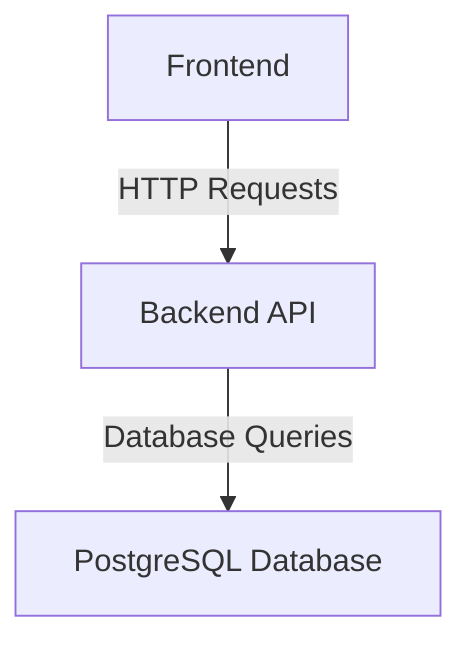
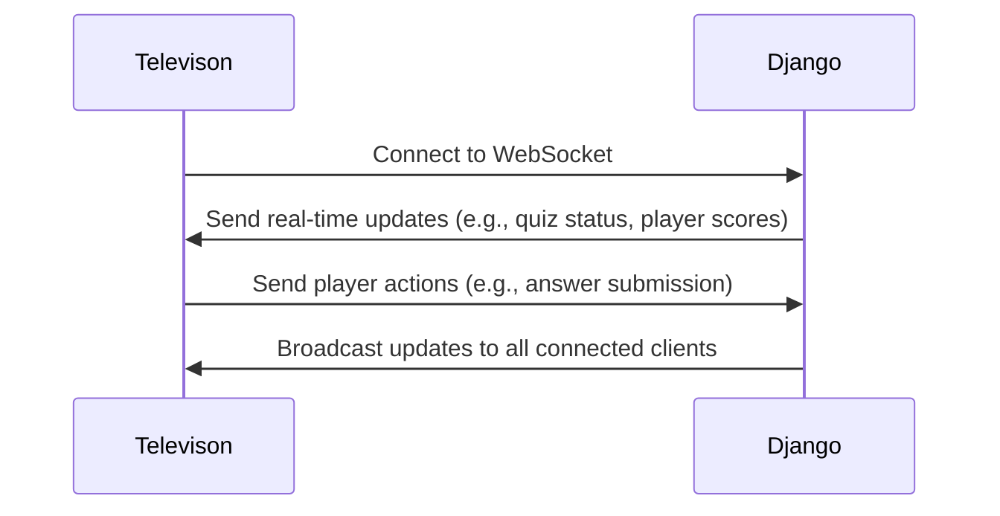

# Blindtest

The Django application for blindtest, a music quiz game. It allows users to create and manage quizzes, and players to participate in them. It stores all the necessary data in a PostgreSQL database and provides an API for the frontend to interact with. The application is built using Django REST Framework and is designed to be scalable and maintainable.

## Global Architecture

### Rest Api

The application exposes a REST API that allows the frontend to interact with the backend. The API is built using Django REST Framework and follows RESTful principles. It provides endpoints for managing quizzes, questions, answers, and player scores.

### Websocket

The application also exposes a WebSocket endpoint for real-time communication between the frontend and backend. This allows for real-time updates on quiz status, player scores, and other game events.

It uses Django Channels to handle WebSocket connections and manage real-time communication. The WebSocket connection allows the frontend to receive updates from the backend without needing to poll for changes, providing a more responsive user experience.

