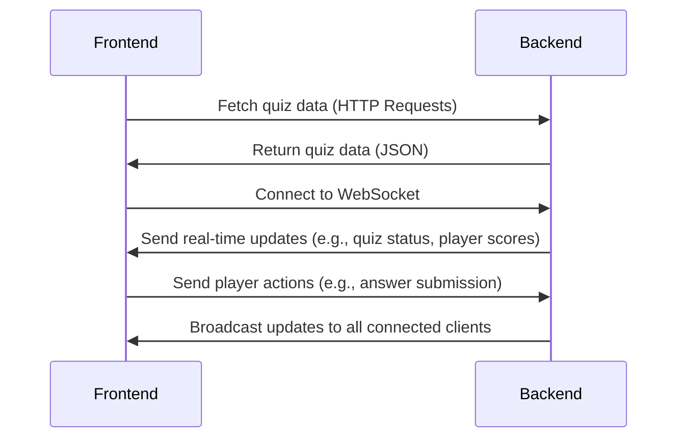

# Television Frontend

The television frontend is Nuxt application that allows the user to display the quiz on a television screen. It connects to the backend API to fetch quiz data and uses WebSockets to receive real-time updates during the quiz. The frontend is designed to be responsive and user-friendly, providing an engaging experience for players participating in the quiz.

## Global Architecture

